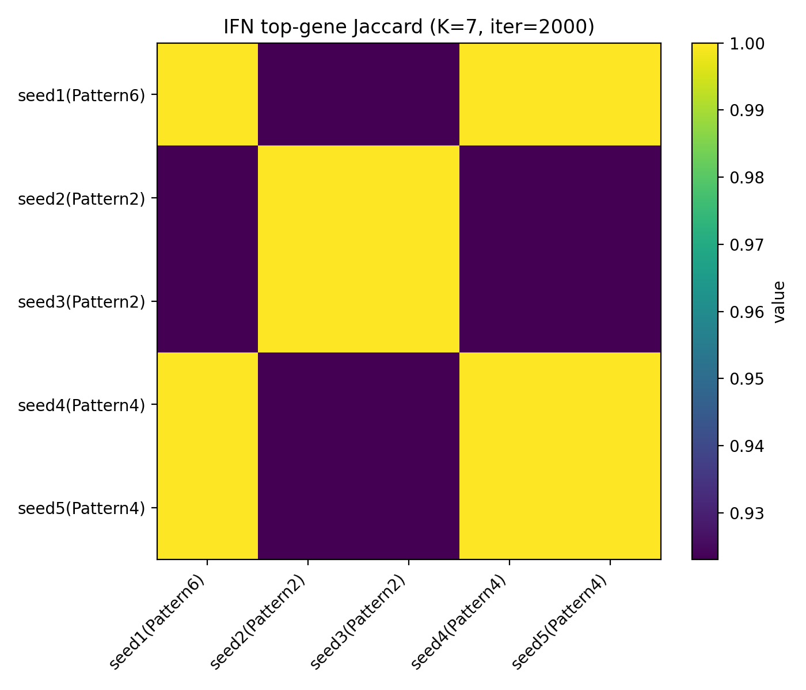

# **Additional Information**
***

## **Helpful Links**
***

<u>Terms and concepts covered:</u>

- AnnData
- PBMC
- IFN-beta
- interferon-stimulated gene
- latent variable
- non-negative matrix factorization
- CoGAPS
- `A` matrix
- `P` matrix
- pseudobulk
- log2 fold-change

<u>Packages used in this case study:</u>

- `anndata`
- `pandas`
- `numpy`
- `scipy`
- `matplotlib`
- `PyCoGAPS`

## Optional HPC Appendix: How `K = 7` Was Selected
***

This section is for instructors and advanced users. Learners do not need to run the sweep to complete the case study.

The main analysis uses a saved `K = 7` CoGAPS result. The choice of `K = 7` was supported by a limited sweep over multiple ranks, seeds, and iteration counts. The sweep evaluated IFN-pattern correlation and top-gene overlap stability, then selected the smallest stable `K` under the local selection rule.

The final teaching workflow uses:

- `K = 7`
- `seed = 2`
- `n_iter = 2000`
- one non-distributed chosen-model result

## Sweep summary

```{python}
summary_by_k = pd.read_csv(SUMMARY_BY_K_CSV)
summary_by_k.sort_values(["K", "n_iter"])
```

For `K = 7`, `n_iter = 2000`, the available sweep summary has strong IFN-correlation stability and high top-gene overlap. The selected setting should be described as the best choice under this local sweep rule, not as a universal optimum.

## Optional command-line workflow

The original project used SLURM scripts and helper Python scripts. These scripts are preserved in the source analysis folder and selected scripts are copied into this draft under `scripts/` for provenance.

```bash
# Generate jobs table
python make_cogaps_jobs_tsv.py

# Prepare cached inputs and jobs on a cluster
sbatch prep_cogaps_cache_and_jobs_rhino_light.sbatch

# Run the array sweep
sbatch cogaps_sweep_array_singleprocess_rhino_light.sbatch

# Aggregate sweep results
sbatch aggregate_cogaps_results_rhino_light.sbatch
```

This is cluster-specific workflow provenance. It is not intended to be a turnkey cross-cluster deployment guide.

## Figures for model-selection context

{fig-alt="Top-gene Jaccard overlap heatmap for IFN-associated patterns across K equals 7, n_iter equals 2000 sweep runs." width=700 .lightbox}

## Directionality analysis provenance

The directionality analysis used in the main case study was generated with:

- `scripts/pattern_directionality_analysis.py`
- `data/results/pattern_gene_directionality_global.csv`
- `data/results/pattern_gene_directionality_by_celltype.csv`
- `data/results/pattern_direction_summary.csv`

It is a targeted analysis of top CoGAPS pattern genes, not a genome-wide differential-expression analysis.

***
