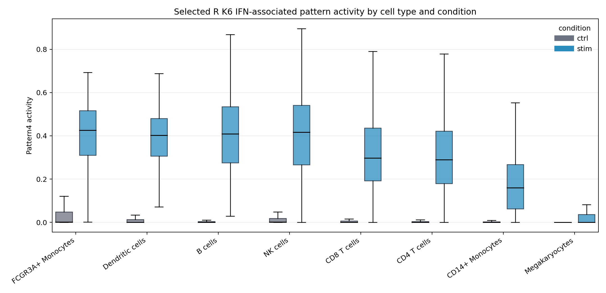
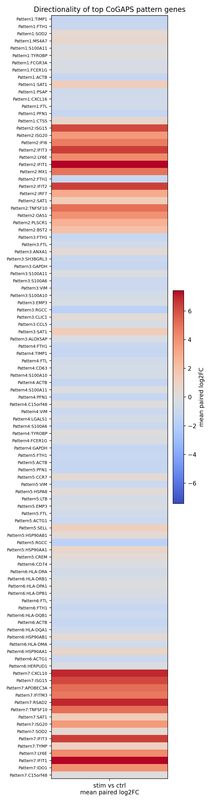

# **Data Visualization**
***

Visualizations help us check the structure of the dataset before interpreting model results.

## Cell types by condition

```{python}
celltype_condition = (
    adata_cells.obs.groupby(["cell_type", "condition"], observed=True)
    .size()
    .reset_index(name="n_cells")
)

celltype_condition.head()
```

```{python}
pivot_counts = (
    celltype_condition
    .pivot(index="cell_type", columns="condition", values="n_cells")
    .fillna(0)
    .sort_values(by=["ctrl", "stim"], ascending=False)
)

ax = pivot_counts.plot(kind="bar", figsize=(9, 4))
ax.set_ylabel("Number of cells")
ax.set_xlabel("Cell type")
ax.set_title("Cells per annotated cell type and condition")
plt.xticks(rotation=45, ha="right")
plt.tight_layout()
plt.show()
```

<details><summary>R alternative: cell types by condition</summary>

```{r}
celltype_condition_r <- as.data.frame(table(
  cell_type = colData(sce_cells)$cell_type,
  condition = colData(sce_cells)$condition
), stringsAsFactors = FALSE)
colnames(celltype_condition_r) <- c("cell_type", "condition", "n_cells")
head(celltype_condition_r)
```

```{r}
ggplot(celltype_condition_r, aes(x = cell_type, y = n_cells, fill = condition)) +
  geom_col(position = "dodge") +
  labs(
    title = "Cells per annotated cell type and condition",
    x = "Cell type",
    y = "Number of cells"
  ) +
  theme_minimal(base_size = 11) +
  theme(axis.text.x = element_text(angle = 45, hjust = 1))
```

</details>

The conditions are nearly balanced overall and within major cell types. That makes it easier to compare pattern activity between control and stimulated cells, although donor-aware summaries are still important.

## Preview of the main CoGAPS pattern

The next plot was generated from the selected CoGAPS model. We will rebuild the pieces behind this interpretation in the Data Analysis section.

{fig-alt="Pattern2 activity split by PBMC cell type and control or IFN-beta stimulated condition." width=800 .lightbox}

## Preview of pattern-gene directionality

CoGAPS tells us which genes define a pattern. It does not directly tell us whether those genes are up or down in stimulation. For that, we performed a targeted paired pseudobulk directionality check.

{fig-alt="Heatmap showing mean paired stim-versus-control log2 fold changes for top CoGAPS pattern genes." width=600 .lightbox}

We will inspect the directionality tables directly in the analysis section for both the Python and R saved results.

***
